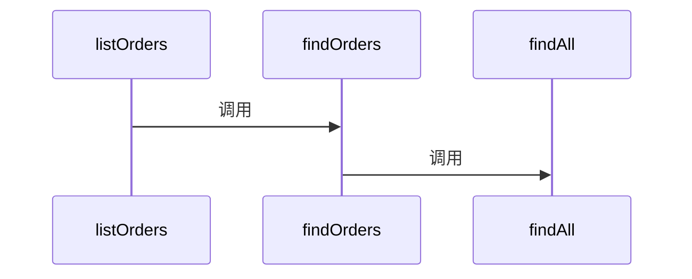
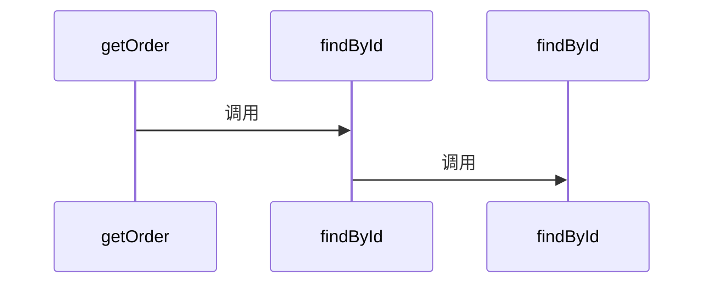
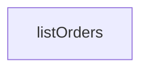
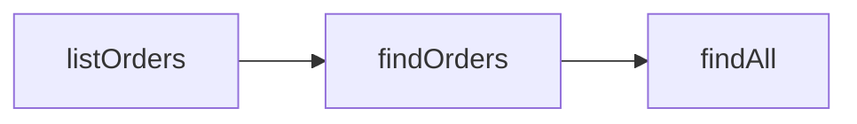
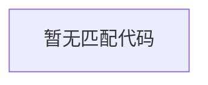

# sample-java — ONBOARDING 架构交接手册

> 由 CodeCompass 自动生成 · repoId: `repo-8f79ee96-6cfe-46f2-9a6a-97d807891f68` · 生成时间：2026-08-22T13:34:02.604Z
> 配置值从不落盘（Issue 06 脱敏引擎），本文档不包含任何敏感配置值。

## 技术栈（Tech Stack）

未检测到框架依赖。

## 架构指标（Architecture Scale）

| 指标 | 数量 |
| --- | --- |
| Routes | 1 |
| Services | 1 |
| Repositories | 1 |
| Advices | 0 |
| Classes | 1 |
| Interfaces | 0 |
| Methods | 7 |
| Fields | 2 |
| Config keys | 3 |
| Files | 5 |

## 脱敏配置（Config Topology）

> 值已脱敏：配置仅索引 key，value 从不存储与导出（Issue 06）。

| Group | Key | 文件 | 敏感 |
| --- | --- | --- | --- |
| other | `groupId` | `pom.xml:2` | - |
| other | `artifactId` | `pom.xml:3` | - |
| other | `version` | `pom.xml:4` | - |

## Top 核心 API（时序图）

### listOrders

- 控制器：`OrdersController`
- 源码：`src/main/java/com/demo/OrdersController.java:7`
- 深度：3
- 调用链：`listOrders → findOrders → findAll`

### getOrder

- 控制器：`OrdersController`
- 源码：`src/main/java/com/demo/OrdersController.java:11`
- 深度：3
- 调用链：`getOrder → findById → findById`

## Onboarding 路线（3 条）

### 路线一：鉴权与拦截链（`auth-chain`）

从 HTTP 过滤器到拦截器再到受保护业务端点，理解请求如何经过每一道鉴权关卡。

1. OrdersController.listOrders（受保护端点） — `src/main/java/com/demo/OrdersController.java:7`

### 路线二：核心主业务流（`main-flow`）

从调用深度最深的 REST 端点出发，沿静态可解析调用链逐层下钻到服务与数据层。

1. OrdersController.listOrders（入口接口） — `src/main/java/com/demo/OrdersController.java:7`
2. findOrders — `src/main/java/com/demo/OrderService.java:7`
3. findAll — `src/main/java/com/demo/OrderRepository.java:5`

### 路线三：全局异常拦截（`error-handling`）

从 @RestControllerAdvice 入口到每个 @ExceptionHandler，了解异常的统一出口。

该路线暂无步骤。

