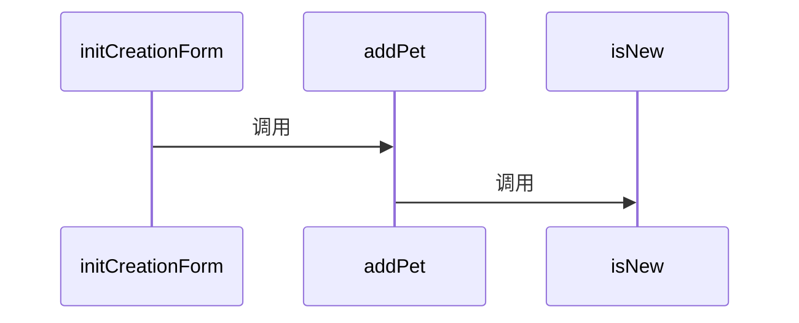
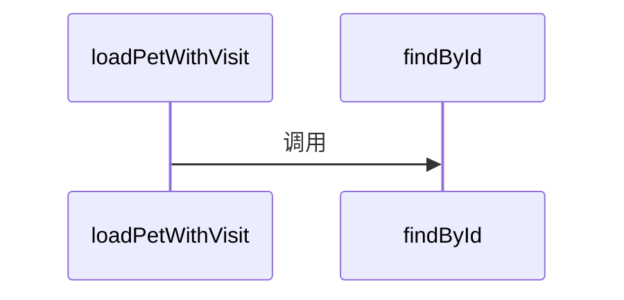
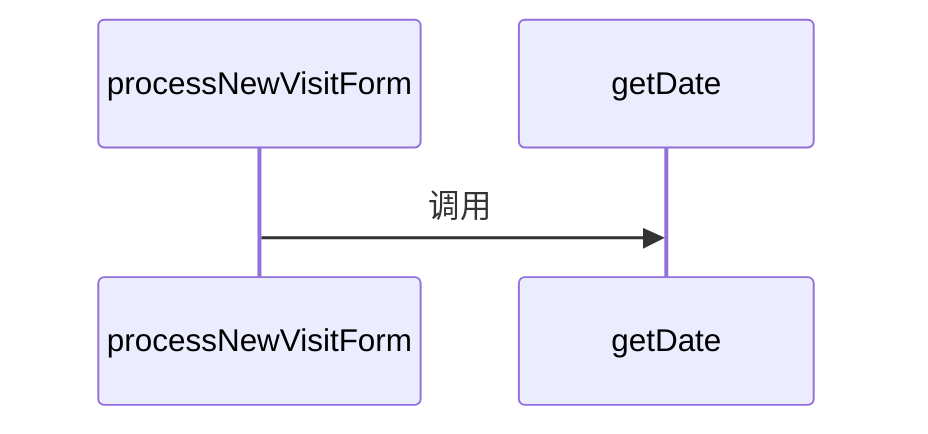
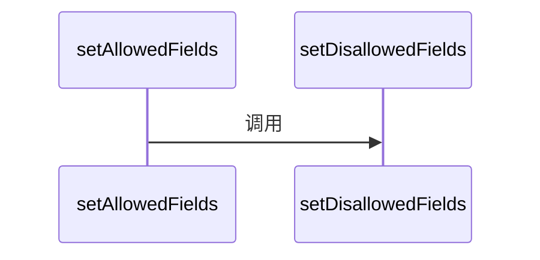
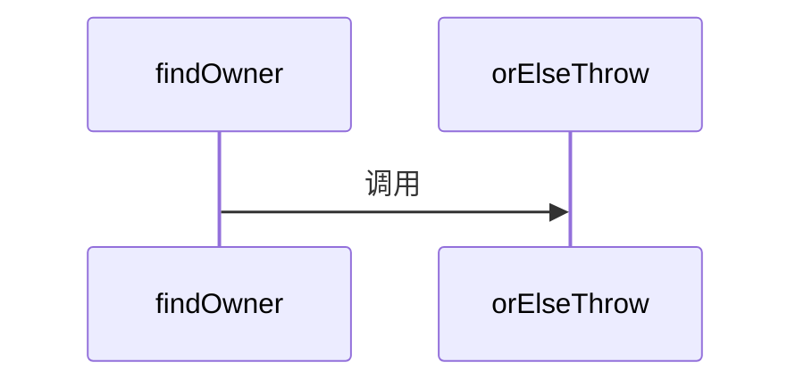
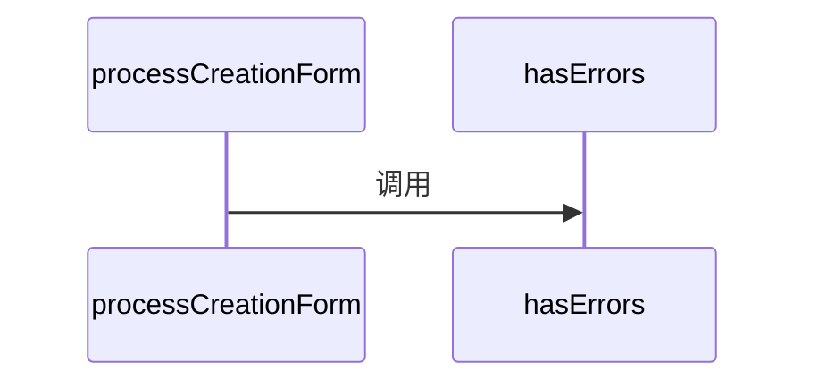
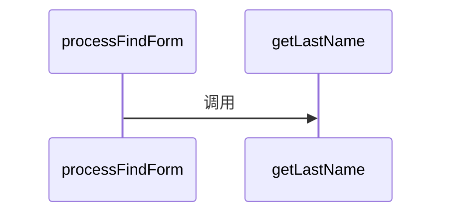
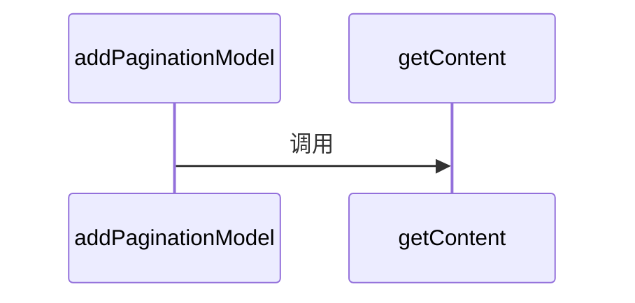
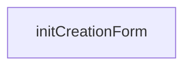
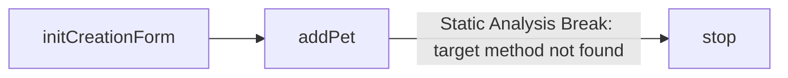

# petclinic — ONBOARDING 架构交接手册

> 由 CodeCompass 自动生成 · repoId: `repo-2285c50c-4edd-4095-a671-06b5f740a1ea` · 生成时间：2026-08-23T05:40:52.889Z
> 配置值从不落盘（Issue 06 脱敏引擎），本文档不包含任何敏感配置值。

## 技术栈（Tech Stack）

高亮：Spring Boot、Jakarta EE、Spring Data JPA、MySQL、PostgreSQL、H2、Caffeine、Spring Boot Actuator、JUnit、Testcontainers

### Database（4）

- `com.h2database:h2 (runtime)` — `pom.xml:78`
- `com.mysql:mysql-connector-j (runtime)` — `pom.xml:88`
- `org.postgresql:postgresql (runtime)` — `pom.xml:93`
- `org.testcontainers:testcontainers-mysql (test)` — `pom.xml:178`

### ORM（2）

- `org.springframework.boot:spring-boot-starter-data-jpa` — `pom.xml:52`
- `org.springframework.boot:spring-boot-starter-data-jpa-test (test)` — `pom.xml:123`

### Cache（1）

- `com.github.ben-manes.caffeine:caffeine (runtime)` — `pom.xml:83`

### Observability（2）

- `org.springframework.boot:spring-boot-starter-actuator` — `pom.xml:44`
- `org.springframework.boot:spring-boot-starter-actuator-test (test)` — `pom.xml:153`

### Test（2）

- `org.springframework.boot:spring-boot-testcontainers (test)` — `pom.xml:158`
- `org.testcontainers:testcontainers-junit-jupiter (test)` — `pom.xml:173`

### Framework（14）

- `org.springframework.boot:spring-boot-starter-cache` — `pom.xml:48`
- `org.springframework.boot:spring-boot-starter-thymeleaf` — `pom.xml:56`
- `org.springframework.boot:spring-boot-starter-validation` — `pom.xml:60`
- `org.springframework.boot:spring-boot-starter-webmvc` — `pom.xml:64`
- `javax.cache:cache-api` — `pom.xml:69`
- `jakarta.xml.bind:jakarta.xml.bind-api` — `pom.xml:73`
- `org.springframework.boot:spring-boot-devtools` — `pom.xml:117`
- `org.springframework.boot:spring-boot-starter-restclient (test)` — `pom.xml:128`
- `org.springframework.boot:spring-boot-starter-restclient-test (test)` — `pom.xml:133`
- `org.springframework.boot:spring-boot-starter-thymeleaf-test (test)` — `pom.xml:138`
- `org.springframework.boot:spring-boot-starter-validation-test (test)` — `pom.xml:143`
- `org.springframework.boot:spring-boot-starter-webmvc-test (test)` — `pom.xml:148`
- `org.springframework.boot:spring-boot-docker-compose (test)` — `pom.xml:163`
- `org.springframework.boot:spring-boot-starter-cache-test (test)` — `pom.xml:168`

### Other（5）

- `org.webjars:webjars-locator-lite (runtime)` — `pom.xml:98`
- `org.webjars.npm:bootstrap (runtime)` — `pom.xml:104`
- `org.webjars.npm:font-awesome (runtime)` — `pom.xml:110`
- `com.puppycrawl.tools:checkstyle` — `pom.xml:225`
- `io.spring.nohttp:nohttp-checkstyle` — `pom.xml:230`

## 架构指标（Architecture Scale）

| 指标 | 数量 |
| --- | --- |
| Routes | 6 |
| Services | 0 |
| Repositories | 3 |
| Advices | 0 |
| Classes | 38 |
| Interfaces | 0 |
| Methods | 174 |
| Fields | 71 |
| Config keys | 52 |
| Files | 47 |

## 脱敏配置（Config Topology）

> 值已脱敏：配置仅索引 key，value 从不存储与导出（Issue 06）。

| Group | Key | 文件 | 敏感 |
| --- | --- | --- | --- |
| datasource | `database` | `src/main/resources/application-mysql.properties:2` | - |
| datasource | `spring.datasource.url` | `src/main/resources/application-mysql.properties:3` | - |
| datasource | `spring.datasource.username` | `src/main/resources/application-mysql.properties:4` | - |
| datasource | `spring.datasource.password` | `src/main/resources/application-mysql.properties:5` | ⚠ sensitive |
| other | `spring.sql.init.mode` | `src/main/resources/application-mysql.properties:7` | - |
| datasource | `database` | `src/main/resources/application-postgres.properties:2` | - |
| datasource | `spring.datasource.url` | `src/main/resources/application-postgres.properties:3` | - |
| datasource | `spring.datasource.username` | `src/main/resources/application-postgres.properties:4` | - |
| datasource | `spring.datasource.password` | `src/main/resources/application-postgres.properties:5` | ⚠ sensitive |
| other | `spring.sql.init.mode` | `src/main/resources/application-postgres.properties:7` | - |
| datasource | `database` | `src/main/resources/application.properties:2` | - |
| other | `spring.sql.init.schema-locations` | `src/main/resources/application.properties:3` | - |
| other | `spring.sql.init.data-locations` | `src/main/resources/application.properties:4` | - |
| other | `spring.thymeleaf.mode` | `src/main/resources/application.properties:7` | - |
| other | `spring.jpa.hibernate.ddl-auto` | `src/main/resources/application.properties:10` | - |
| other | `spring.jpa.open-in-view` | `src/main/resources/application.properties:11` | - |
| other | `spring.jpa.hibernate.naming.physical-strategy` | `src/main/resources/application.properties:12` | - |
| other | `spring.jpa.properties.hibernate.default_batch_fetch_size` | `src/main/resources/application.properties:13` | - |
| other | `spring.messages.basename` | `src/main/resources/application.properties:16` | - |
| other | `management.endpoints.web.exposure.include` | `src/main/resources/application.properties:21` | - |
| other | `logging.level.org.springframework` | `src/main/resources/application.properties:24` | - |
| other | `spring.web.resources.cache.cachecontrol.max-age` | `src/main/resources/application.properties:29` | - |

## Top 核心 API（时序图）

### initCreationForm

- 控制器：`PetController`
- 源码：`src/main/java/org/springframework/samples/petclinic/owner/PetController.java:101`
- 深度：2
- 调用链：`initCreationForm → addPet → isNew`

### loadPetWithVisit

- 控制器：`VisitController`
- 源码：`src/main/java/org/springframework/samples/petclinic/owner/VisitController.java:64`
- 深度：2
- 调用链：`loadPetWithVisit → findById`

### processNewVisitForm

- 控制器：`VisitController`
- 源码：`src/main/java/org/springframework/samples/petclinic/owner/VisitController.java:98`
- 深度：2
- 调用链：`processNewVisitForm → getDate`

### setAllowedFields

- 控制器：`OwnerController`
- 源码：`src/main/java/org/springframework/samples/petclinic/owner/OwnerController.java:60`
- 深度：1
- 调用链：`setAllowedFields → setDisallowedFields`

### findOwner

- 控制器：`OwnerController`
- 源码：`src/main/java/org/springframework/samples/petclinic/owner/OwnerController.java:65`
- 深度：1
- 调用链：`findOwner → orElseThrow`

### initCreationForm

- 控制器：`OwnerController`
- 源码：`src/main/java/org/springframework/samples/petclinic/owner/OwnerController.java:73`
- 深度：1
- 调用链：`initCreationForm`

### processCreationForm

- 控制器：`OwnerController`
- 源码：`src/main/java/org/springframework/samples/petclinic/owner/OwnerController.java:78`
- 深度：1
- 调用链：`processCreationForm → hasErrors`

### initFindForm

- 控制器：`OwnerController`
- 源码：`src/main/java/org/springframework/samples/petclinic/owner/OwnerController.java:90`
- 深度：1
- 调用链：`initFindForm`

### processFindForm

- 控制器：`OwnerController`
- 源码：`src/main/java/org/springframework/samples/petclinic/owner/OwnerController.java:95`
- 深度：1
- 调用链：`processFindForm → getLastName`

### addPaginationModel

- 控制器：`OwnerController`
- 源码：`src/main/java/org/springframework/samples/petclinic/owner/OwnerController.java:124`
- 深度：1
- 调用链：`addPaginationModel → getContent`

## Onboarding 路线（3 条）

### 路线一：鉴权与拦截链（`auth-chain`）

从 HTTP 过滤器到拦截器再到受保护业务端点，理解请求如何经过每一道鉴权关卡。

1. PetController.initCreationForm（受保护端点） — `src/main/java/org/springframework/samples/petclinic/owner/PetController.java:101`

### 路线二：核心主业务流（`main-flow`）

从调用深度最深的 REST 端点出发，沿静态可解析调用链逐层下钻到服务与数据层。

1. PetController.initCreationForm（入口接口） — `src/main/java/org/springframework/samples/petclinic/owner/PetController.java:101`
2. addPet — `src/main/java/org/springframework/samples/petclinic/owner/Owner.java:97`
3. isNew（[Static Analysis Break: target method not found]） — `src/main/java/org/springframework/samples/petclinic/owner/Owner.java:98`

### 路线三：全局异常拦截（`error-handling`）

从 @RestControllerAdvice 入口到每个 @ExceptionHandler，了解异常的统一出口。

该路线暂无步骤。

