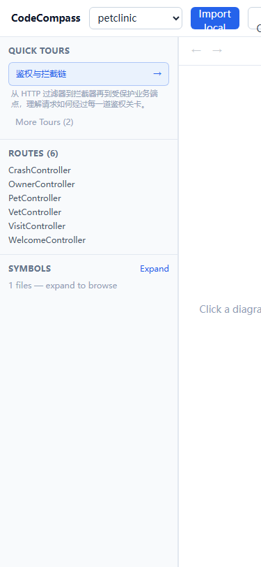
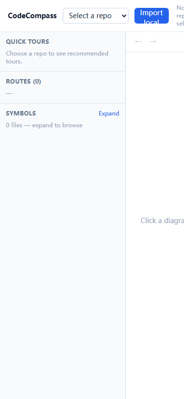

# 🧪 产品体验与缺陷报告 - CodeCompass v0.2.0-beta

## 1. 体验总览 (Executive Summary)

* **体验角色**：新用户 / 深度创作者 / 破坏性测试者（三画像切换，均为第一人称实测）
* **健康指数**：🔴 阻断级 — 核心卖点（AST 确定性调用链）在 UI 上不可达，Top API 追踪返回与点击无关的答案
* **核心体感**：导入→看板→Tour→问答的主链路"能走通"，但数据字段名前后端分裂导致符号树、本地路径、路由 tooltip 大面积错乱；点击 Top API 得到的答案与点击项无关，且所有问答答案都带 "Static mock answer" 占位文案；移动端 375px 下布局完全溢出、提问按钮被遮挡无法点击。

**测试环境**
- 应用：CodeCompass v0.2.0-beta（React 19 + Vite 前端 `apps/repoqa-web` + Express/SQLite 后端 `services/control-plane`）
- 隔离实例：`http://127.0.0.1:48731`（独立数据目录，不影响真实服务）
- 测试数据：`spring-petclinic`（repo `repo-2285c50c-4edd-4095-a671-06b5f740a1ea`，47 个 Java 文件 / 344 个符号）与 CodeCompass 自身（repo `repo-9b243093-9348-483d-9b0e-3ca6cb495c3b`，含 `.scratch/issue17-dogfood` 下 petclinic 微服务副本，Routes=18）
- LLM：未配置（`isLlmConfigured=false`），所有查询均走确定性降级路径
- 浏览器：Chromium（Playwright 1.61），视口 1440×900 与 375×812（移动端）

**缺陷统计**：P0 阻断 0 项 / P1 严重 4 项 / P2 一般 4 项 / P3 体验优化 5 项，共 13 项。

---

## 2. 缺陷与体验问题清单 (Defect Items)

### 🔴 [Bug-01] [符号树/路由列表/TopBar] API 返回 camelCase 而前端 types 用 snake_case，字段全部读不到

* **严重级别**：P1-严重
* **问题类别**：功能缺陷
* **复现环境**：Chromium 1440×900 / 隔离实例 48731 / petclinic 仓库

#### 🐾 严格复现步骤 (Step-by-Step Reproduction)
1. 打开 `http://127.0.0.1:48731`，在 `[data-testid=repo-select]` 选择 `petclinic`。
2. 等待 3s，展开 `[data-testid=symbols-toggle]` 符号树。
3. 观察符号树头部计数与分组；查看 TopBar 仓库路径；悬停路由列表项查看 tooltip。

#### ⚖️ 现象比对 (Expected vs. Actual)
* **实际现象 (Actual)**：
  - 符号树计数显示 **"1 files"**（实际应为 47 个 Java 文件），所有 symbol 分到未命名分组（`buildSymbolTree` 按 `s.file_path` 分组全是 `undefined` key）。
  - TopBar 仓库路径空白（`currentRepo.local_path` 为 undefined，`HEADER_SPANS=['']`），仅显示名称。
  - 路由列表项 tooltip 显示 `undefined:undefined`。
* **预期行为 (Expected)**：符号树按 47 个文件分组、TopBar 显示本地绝对路径、路由 tooltip 显示 `文件路径:行号`。

#### 🔍 疑似根因与线索 (Suspected Cause & Code Context)
* **疑似文件/位置**：`apps/repoqa-web/src/types.ts`（`Repo.local_path / file_count / RepoSymbol.file_path / line_start`）vs 后端 API JSON（实测返回 `localPath/fileCount/filePath/lineStart/repoId`，curl 实证），`apps/repoqa-web/src/client/RepoQAClient.ts`（无字段映射）。
* **状态/网络线索**：`GET /api/repos` 返回 `{"localPath":"...","fileCount":47,...}`；`GET /api/repos/{id}/symbols` 返回 `{"filePath":"...","lineStart":33,...}`，前端按 snake_case 读取全部落空。
* **根因确认**：`types.ts` 第 12-16 行 `Repo` 接口与第 28-38 行 `RepoSymbol` 接口仍为 snake_case；同一文件内新 dashboard 类型（`TechStackItem.filePath`、`TopApiEntry.filePath/lineStart`）已是 camelCase，说明是迁徙遗漏，非后端问题。

#### 🤖 编码 Agent 专用修复 Prompt (Coder Agent Instruction)
> "修复 CodeCompass 前端类型与后端 API 字段名的分裂。
> 1. 修改 `apps/repoqa-web/src/types.ts`：将 `Repo` 的 `local_path/branch/file_count/symbol_count/created_at/updated_at` 改为 `localPath/fileCount/symbolCount/createdAt/updatedAt`；将 `RepoSymbol` 的 `repo_id/file_path/line_start/line_end` 改为 `repoId/filePath/lineStart/lineEnd`（与后端 JSON 及文件内其他类型保持一致）。
> 2. 全局搜索并更新所有使用字段处：`hooks/useRepoCatalog.ts`、`hooks/useSymbols.ts`（`s.file_path` → `s.filePath`）、`components/Sidebar.tsx`（`r.file_path/r.line_start`）、`components/TopBar.tsx`（`currentRepo.local_path`）、`components/Inspector.tsx`、`hooks/useInspector.ts` 等。
> 3. 若改为 snake_case 的兼容需求（例如既有后端 bug），则改 `RepoQAClient` 增加响应映射函数——但优先采用前端统一 camelCase。
> 4. 验收标准：①符号树计数等于 `scale.files`（petclinic=47）且按文件正确分组；②TopBar 显示仓库 `localPath`；③路由 tooltip 显示 `路径:行号`；④`listSymbols` 返回的每条 symbol 的 `filePath/lineStart` 均非 undefined。"

---

### 🔴 [Bug-02] [Top API] 点击 Top API 入口得到的追踪答案与点击项无关，且带占位文案

* **严重级别**：P1-严重
* **问题类别**：功能缺陷
* **复现环境**：Chromium 1440×900 / petclinic 仓库

#### 🐾 严格复现步骤 (Step-by-Step Reproduction)
1. 选择 `petclinic` 仓库，等待看板加载。
2. 点击任意 `[data-testid=api-entry]`（例如 `initCreationForm`）。
3. 观察跳转后的 chat 答案、Source trace 锚点与 Mermaid 节点。

#### ⚖️ 现象比对 (Expected vs. Actual)
* **实际现象 (Actual)**：点击 `initCreationForm | PetController | depth 2 | initCreationForm → addPet → isNew` 后，答案文字为 `Static mock answer for "initCreationForm 的完整调用链是怎样的？".`；下方 Source trace / Mermaid / 锚点全部指向 **CrashController / addInterceptors**（`src/main/java/.../system/CrashController.java` L29、`WebConfiguration.java` L56），与点击项完全无关。
* **预期行为 (Expected)**：针对点击的 API 条目（PetController.initCreationForm）进行调用链解析，答案与锚点指向该 API 自身。

#### 🔍 疑似根因与线索 (Suspected Cause & Code Context)
* **疑似文件/位置**：`apps/repoqa-web/src/components/DashboardView.tsx` 第 221-222 行（`onClick={() => onTrace(...)}`）→ `App.tsx handleTrace` → `useChat.submit(question)`（未传 mode）→ 后端确定性"architecture"分支选取"第一个 route + 第一个 method"。
* **状态/网络线索**：后端在无 LLM 时确定性降级，答案模板硬编码 `Static mock answer for ...`，且选取目标与 query 无关联；在确定性分支中 `CrashController` 是 petclinic 扫描到的第一个 @Controller 类。

#### 🤖 编码 Agent 专用修复 Prompt (Coder Agent Instruction)
> "修复 Top API 点击后追踪结果与点击项无关的问题。
> 1. 检查后端确定性降级路径（services/control-plane，无 LLM 时）：确保 Top API 追踪不管是否配置 LLM，都基于点击的 `controller + method + hops` 进行源码级定位，而不是取第一个 route/method。
> 2. 前端 `DashboardView` 的 `onTrace(question)` 应改为 `onTrace(api)` 并携带 `api.name/controller/filePath/lineStart/hops`，App 层透传给查询链路。
> 3. 移除或改为真实内容的后端占位文案 `Static mock answer for ...`（该文案出现在所有确定性问答里，属于未完成标记）。
> 4. 验收标准：①点击 `initCreationForm` 后答案/锚点/Mermaid 均指向 `PetController.initCreationForm`；②任意 Top API 点击结果与点击项 `controller` 一致；③答案不再包含 'Static mock answer' 字样。"

---

### 🔴 [Bug-03] [核心卖点] 前端 UI 无法触发 `mode=call-chain`，AST 确定性调用链在界面不可达

* **严重级别**：P1-严重
* **问题类别**：功能缺陷
* **复现环境**：Chromium / 任意仓库 / 代码检索 + 实测

#### 🐾 严格复现步骤 (Step-by-Step Reproduction)
1. 在 `apps/repoqa-web/src` 全局搜索 `mode` / `call-chain` 调用。
2. 实测通过所有 UI 入口（Top API 点击 / Chat 提问 / 深度关联）观察发出的请求 URL。

#### ⚖️ 现象比对 (Expected vs. Actual)
* **实际现象 (Actual)**：仅在 `DashboardView.tsx` 注释和 `types.ts QueryMode` 定义中出现 `call-chain`；`RepoQAClient` 的 `queryRepo` 支持 `mode` 参数、后端 `/query?mode=call-chain` 本身工作正常（含锚点+mermaid+break 标记），但前端没有任何调用传入 `mode`，所有查询走默认 architecture 分支。
* **预期行为 (Expected)**：点击 Top API 时应自动以 `mode=call-chain` 发起追踪（对齐核心价值主张"AST 确定性调用链"），或至少 UI 提供模式切换。

#### 🔍 疑似根因与线索 (Suspected Cause & Code Context)
* **疑似文件/位置**：`apps/repoqa-web/src/components/DashboardView.tsx`（注释承认应发起 call-chain trace，但只传 question）、`App.tsx handleTrace`、`useChat.submit`（`mode` 参数存在但调用方未传）。
* **状态/网络线索**：`grep -rn "mode" apps/repoqa-web/src` 无任何 `mode=` 传参；后端 call-chain 模式经 curl 验证可用。

#### 🤖 编码 Agent 专用修复 Prompt (Coder Agent Instruction)
> "让 UI 真正使用 call-chain 模式。
> 1. 修改 `App.tsx handleTrace`：`useChat.submit` 增加第二个参数 `'call-chain'`（或根据入口选择 mode）。
> 2. 检查 `useChat.submit(question, mode?)` 与 `RepoQAClient.queryRepo(repoId, question, mode)` 的 mode 透传，确保最终 URL 带 `&mode=call-chain`。
> 3. 可选：在 Chat 输入区提供模式选择（architecture / call-chain / environment），持久化用户偏好。
> 4. 验收标准：①点击 Top API 后浏览器 Network 显示 `/query?question=...&mode=call-chain`；②后端返回 call-chain 特有事件（break/mermaid/anchors）；③代码注释与实现行为一致。"

---

### 🔴 [Bug-04] [响应式布局] 375px 移动端视口严重横向溢出，提问按钮被遮挡无法点击

* **严重级别**：P1-严重
* **问题类别**：视觉适配
* **复现环境**：Chromium 375×812（移动视口） / 隔离实例

#### 🐾 严格复现步骤 (Step-by-Step Reproduction)
1. 打开隔离实例，视口宽度 375px（空态或已选仓库均可）。
2. `document.documentElement.scrollWidth` 实测 = 640（空态）/ 747（petclinic dashboard），`innerWidth` = 375。
3. 尝试点击 `[data-testid=open-chat]`（提问）按钮。

#### ⚖️ 现象比对 (Expected vs. Actual)
* **实际现象 (Actual)**：Sidebar 固定 `w-64`（256px）+ Inspector 固定 `min-w-96`（384px）合计 640px，超出视口 265px；中间 Canvas/Dashboard 区域被挤压为 0 宽。实测 `getBoundingClientRect`：sidebar l=0 r=256，inspector l=256 r=640，`export-onboarding` 按钮 l=356 r=505；点击 `open-chat` 失败——Inspector 子树覆盖按钮拦截指针事件（Playwright 报 `subtree intercepts pointer events`）。`overflow-x: visible` 无横向滚动防护。

    
* **预期行为 (Expected)**：375px 视口下无横向溢出；侧边栏/内容区/Inspector 可折叠或自适应；提问按钮可点。

#### 🔍 疑似根因与线索 (Suspected Cause & Code Context)
* **疑似文件/位置**：`apps/repoqa-web/src/App.tsx` 第 106 行 `
` 三栏布局；`components/Sidebar.tsx` 第 39 行 `w-64 shrink-0`；`components/Inspector.tsx` 第 78 行 `w-1/3 min-w-96 shrink-0`。均无可折叠断点/媒体查询降级。
* **状态/网络线索**：无 console error；纯 CSS 问题（`scrollWidth > innerWidth`，`hasHScroll: true`）。

#### 🤖 编码 Agent 专用修复 Prompt (Coder Agent Instruction)
> "修复 375px（及更小）视口下布局横向溢出与会话按钮不可点。
> 1. 在 `App.tsx` 三栏布局增加响应式断点（例如 Tailwind `max-md`）：视口 <768px 时 Inspector 改为底部抽屉/全屏覆盖或隐藏（提供打开入口），Sidebar 改为可收起抽屉，保证内容区至少保留可用宽度且无横向滚动。
> 2. 给根容器加 `overflow-x: clip` 或 `max-w-full`，避免 `scrollWidth > innerWidth`。
> 3. 确保 `[data-testid=open-chat]`、`[data-testid=export-onboarding]` 在 375px 时位于可视区内且可点击。
> 4. 验收标准：Playwright 375×812 下 `document.documentElement.scrollWidth === 375`；提问按钮可被点击并打开 chat。"

---

### 🔴 [Bug-05] [导入] 无效路径导入只显示 "importRepo failed: 400"，后端错误信息被丢弃

* **严重级别**：P2-一般
* **问题类别**：交互反馈
* **复现环境**：Chromium / 导入弹窗

#### 🐾 严格复现步骤 (Step-by-Step Reproduction)
1. 点击 `Import local repo` 打开导入弹窗。
2. Name 输入任意名，Path 输入一个不存在的路径（如 `C:/no/such/dir`）。
3. 点击提交，观察错误提示。

#### ⚖️ 现象比对 (Expected vs. Actual)
* **实际现象 (Actual)**：弹窗内仅显示 `importRepo failed: 400`；而后端实际返回 JSON `{"error":"local path is not a directory: C:/no/such/dir"}`（curl 实证）。
* **预期行为 (Expected)**：显示后端 error 字段（"local path is not a directory: ..."），让用户知道路径为何无效。

#### 🔍 疑似根因与线索 (Suspected Cause & Code Context)
* **疑似文件/位置**：`apps/repoqa-web/src/client/RepoQAClient.ts` 第 56 行 `throw new Error(`importRepo failed: ${res.status}`)`——未读取 `res.json()` 的 `error` 字段；`TopBar.tsx` 直接展示该错误字符串。
* **证据**：`ui-shots/t5-import-invalid-error.png`。

#### 🤖 编码 Agent 专用修复 Prompt (Coder Agent Instruction)
> "让导入失败展示后端真实原因。
> 1. 修改 `RepoQAClient.importRepo`（同 listRepos/getRepo/etc）：`res.ok` 为 false 时尝试 `await res.json()` 取 `error` 字段，错误消息用 `` `${status} ${payload.error ?? ''}` `` 或直接 `payload.error`。
> 2. 保持 TopBar 展示 error 的现有逻辑不变。
> 3. 验收标准：导入不存在路径时弹窗显示 'local path is not a directory: ...'；网络错误仍显示友好兜底文案。"

---

### 🔴 [Bug-06] [Inspector] 跨文件首次切换时源码高亮 glow 丢失，再次点击同一文件才出现

* **严重级别**：P2-一般
* **问题类别**：状态同步
* **复现环境**：Chromium / 任意仓库 / Inspector

#### 🐾 严格复现步骤 (Step-by-Step Reproduction)
1. 打开一个文件（Inspector 显示源码，glow=1）。
2. 点击符号树/锚点/Mermaid 节点切换到**另一个新文件**。
3. 在切换后立即（0.1s 间隔轮询）读取 `[data-testid=inspector-glow]` 的 decoration 数量。

#### ⚖️ 现象比对 (Expected vs. Actual)
* **实际现象 (Actual)**：首次切换到新文件时 glow=0（装饰未上），同文件再次点击则 glow=1 正常。配置文件中配置文件锚点、mermaid 节点点击均复现（T4b：E:0 / F:1 对照）。
* **预期行为 (Expected)**：任何一次导航到已加载文件都立即出现高亮装饰。

#### 🔍 疑似根因与线索 (Suspected Cause & Code Context)
* **疑似文件/位置**：`apps/repoqa-web/src/components/Inspector.tsx` / `hooks/useInspector.ts`：打开文件后 `useEffect` 内 `setTimeout(0)`（或依赖 monaco 模型 ready）设置 decoration，但切换文件时 monaco 模型尚未 swap 完成，装饰被建到不可见 model 上；无模型 ready 回调或重试机制。
* **证据**：`ui-shots/t4a-glow-first.png`。

#### 🤖 编码 Agent 专用修复 Prompt (Coder Agent Instruction)
> "修复切换文件后 glow 装饰丢失。
> 1. 检查 Inspector 中的 monaco `setModel`/`setValue` 与 glow decoration 的时序：应监听 monaco 模型 'onDidChangeContent' 或使用 `monaco.editor.setModel` 后的回调/`requestAnimationFrame` 重试（最多 3 次，间隔 50ms），确保 `updateDecorations` 在**当前可见模型**上执行。
> 2. 切换文件前先 `clearDecorations()`，新模型就绪后再设置，避免装饰残留另一个 model。
> 3. 验收标准：对同一文件连续切换 5 次（每次换不同文件再切回），glow 每次都能在 500ms 内出现；playwright 轮询 `glow` 失败率为 0。"

---

### 🔴 [Bug-07] [Tour] 0 步 Tour 显示 "Step 1 / 0" 且播放器为空

* **严重级别**：P2-一般
* **问题类别**：功能缺陷
* **复现环境**：Chromium / petclinic 仓库（无 @ControllerAdvice → error-handling tour 0 步）

#### 🐾 严格复现步骤 (Step-by-Step Reproduction)
1. 选择 petclinic 仓库，Quick Tours 列表点击 `error-handling` 类型 tour。
2. 观察 TourPlayer 进度与步骤列表、Mermaid、Inspector。

#### ⚖️ 现象比对 (Expected vs. Actual)
* **实际现象 (Actual)**：进度显示 **"Step 1 / 0"**；步骤列表空；Mermaid 区域"暂无匹配代码"；Inspector "No file open"。用户无法退出到有意义状态（只能返回看板）。
* **预期行为 (Expected)**：0 步 tour 不应出现在列表，或播放器显示明确空态（"当前仓库没有错误处理示例"）并禁用下一步；`Step x / y` 的 y 恒为 `steps.length`。

#### 🔍 疑似根因与线索 (Suspected Cause & Code Context)
* **疑似文件/位置**：`apps/repoqa-web/src/components/TourPlayer.tsx`（进度计算 `current + 1 / steps.length`，未处理 length=0）；`useTours.ts` 未过滤 `steps.length === 0` 的 tour。
* **证据**：`ui-shots/t3b-error-tour.png`。

#### 🤖 编码 Agent 专用修复 Prompt (Coder Agent Instruction)
> "修复 0 步 tour 的展示。
> 1. 在 `useTours`（或后端生成处）过滤 steps 为空的 tour，或在前端 Quick Tours 列表对空 tour 置灰并标注 '暂无内容'。
> 2. 若仍进入 0 步 tour：TourPlayer 在 `steps.length === 0` 时显示空态提示（建议文案），进度显示 '0 / 0' 或隐藏，禁用 Next，提供 '返回看板' 按钮。
> 3. 验收标准：petclinic 的 error-handling tour 不再可播放为 'Step 1 / 0'；任意 0 步 tour 均有明确空态且不出现非法分数。"

---

### 🔴 [Bug-08] [状态持久化] 刷新/浏览器返回丢失全部状态回到空态

* **严重级别**：P2-一般
* **问题类别**：状态同步
* **复现环境**：Chromium / 任意视口

#### 🐾 严格复现步骤 (Step-by-Step Reproduction)
1. 选择 petclinic 仓库并浏览看板。
2. 按 F5 刷新（或浏览器后退）。

#### ⚖️ 现象比对 (Expected vs. Actual)
* **实际现象 (Actual)**：F5 后 `repo-select` 变回空（`input_value` 为 ''）、dashboard 消失、回到未选仓库空态；浏览器返回键从深链回到首页（SPA 无 router/history 集成，URL 状态不保留），再次前进无法恢复。
* **预期行为 (Expected)**：刷新后保留当前仓库选择（URL 带 `?repo=<id>` 或 localStorage），返回/前进可恢复视图。

#### 🔍 疑似根因与线索 (Suspected Cause & Code Context)
* **疑似文件/位置**：`apps/repoqa-web/src/App.tsx`：`initialRepoId` 只处理**首次加载**的 `?repo=`（Issue 16），但选仓后不更新 URL；无 router/react-router，history.back 无状态恢复。
* **证据**：`ui-shots/t2-after-reload.png`、`ui-shots/t6d-after-reload.png`。

#### 🤖 编码 Agent 专用修复 Prompt (Coder Agent Instruction)
> "让刷新/浏览器导航保留状态。
> 1. 选仓成功后 `history.replaceState` 或 `pushState` 更新 URL 为 `/?repo=<id>`（同时保留 initialRepoId 逻辑）。
> 2. 监听 `popstate` 恢复对应仓库；或至少将 `lastRepoId` 存入 `localStorage`，刷新后自动恢复。
> 3. 验收标准：①选择仓库后刷新，select 仍为原仓库且 dashboard 加载；②浏览器后退/前进能切换仓库状态；③无重复请求/竞态。"

---

### 🔴 [Bug-09] [看板] "Routes (6)" 实际列出 @Controller 类名而非 URL 路径，语义误导

* **严重级别**：P3-体验优化
* **问题类别**：功能缺陷
* **复现环境**：Chromium / petclinic 仓库

#### 🐾 严格复现步骤 (Step-by-Step Reproduction)
1. 选择 petclinic 仓库，看板加载 Routes 列。
2. 观察列的条目与点击行为。

#### ⚖️ 现象比对 (Expected vs. Actual)
* **实际现象 (Actual)**：Routes (6) 下列出的是 `CrashController`、`OwnerController` 等 @Controller **类名**（甚至类型为 'route' 的符号名），并非 URL 路径（如 `/owners`、`/pets`）；用户无法从列表得知实际 HTTP 路由。
* **预期行为 (Expected)**：Routes 列表展示 URL 路径（`@GetMapping/@RequestMapping` 等解析），或至少展示"类名 + 该类的 URL 前缀"。

#### 🔍 疑似根因与线索 (Suspected Cause & Code Context)
* **疑似文件/位置**：`services/control-plane` 的 AST parser / symbols：仅把 @Controller 类标 route，未提取方法注解路径。
* **证据**：`ui-shots/t2-home.png`、`ui-shots/t6-ts-repo.png`（Routes (18)）。

#### 🤖 编码 Agent 专用修复 Prompt (Coder Agent Instruction)
> "改进 Routes 语义。
> 1. 扩展后端 symbol parser：对 @Controller/@RestController 类，提取类级路径（@RequestMapping 前缀）与方法级路径（@GetMapping/@PostMapping/@PutMapping/@DeleteMapping 值），生成 `displayPath` 字段（如 `/api/owners/{id}`）。
> 2. 前端 Sidebar Routes 渲染 `displayPath ?? name`，tooltip 保留 文件:行号。
> 3. 验收标准：petclinic 的 Routes 列表出现可识别的 URL 片段（至少含 '/'），而非纯类名。"

---

### 🔴 [Bug-10] [导入] 导入 Name 输入被后端忽略，以目录 basename 为准

* **严重级别**：P3-体验优化
* **问题类别**：功能缺陷
* **复现环境**：Chromium / 导入弹窗

#### 🐾 严格复现步骤 (Step-by-Step Reproduction)
1. 打开导入弹窗，Name 输入 `spring-petclinic`，Path 输入真实 petclinic 路径。
2. 提交后查看仓库列表显示名（实测存成 `petclinic`）；再导入 CodeCompass 输入 `codecompass-self` 存成 `CodeCompass`。

#### ⚖️ 现象比对 (Expected vs. Actual)
* **实际现象 (Actual)**：仓库显示名 = 目录 basename，用户输入的 Name 被丢弃。
* **预期行为 (Expected)**：显示名使用用户输入 Name；若留空则回退 basename。

#### 🔍 疑似根因与线索 (Suspected Cause & Code Context)
* **疑似文件/位置**：`services/control-plane` 的 POST `/api/repos` handler：只读取 `localPath`/`branch`，忽略 body 中 `name`。
* **证据**：`ui-shots/t5-ts-repo.png`（显示名 CodeCompass 而非 codecompass-self）。

#### 🤖 编码 Agent 专用修复 Prompt (Coder Agent Instruction)
> "导入接口尊重用户填写的名称。
> 1. 后端 POST `/api/repos` 读取 body.name，非空时用作 repo `name`，空时回退目录 basename。
> 2. 验收标准：导入时 Name 输入 'my-name' 的仓库列表显示 'my-name'；留空时仍显示目录名。"

---

### 🔴 [Bug-11] [导入] 导入弹窗 ESC 无法关闭（点遮罩可关）

* **严重级别**：P3-体验优化
* **问题类别**：交互反馈
* **复现环境**：Chromium / 导入弹窗

#### 🐾 严格复现步骤 (Step-by-Step Reproduction)
1. 点击 `Import local repo` 打开弹窗。
2. 按 ESC 键。

#### ⚖️ 现象比对 (Expected vs. Actual)
* **实际现象 (Actual)**：ESC 无反应；点击遮罩可关闭。
* **预期行为 (Expected)**：ESC 关闭弹窗（标准对话框行为）。

#### 🔍 疑似根因与线索 (Suspected Cause & Code Context)
* **疑似文件/位置**：TopBar/ImportDialog 组件有遮罩 click 关闭逻辑，但无 `onKeyDown`/`useEffect` 监听 ESC。

#### 🤖 编码 Agent 专用修复 Prompt (Coder Agent Instruction)
> "为导入弹窗增加 ESC 关闭。在弹窗挂载/卸载处监听 `keydown`，e.key === 'Escape' 时执行关闭逻辑（与遮罩点击同一 handler）。验收标准：ESC 可关闭导入弹窗，且不冒泡干扰其他组件。"

---

### 🔴 [Bug-12] [导入] 长导入（约 30s）无进度反馈，按钮仅显示 "Importing…"

* **严重级别**：P3-体验优化
* **问题类别**：交互反馈
* **复现环境**：Chromium / 导入 CodeCompass 大仓库

#### 🐾 严格复现步骤 (Step-by-Step Reproduction)
1. 打开导入弹窗，导入一个较大仓库（如 CodeCompass 自身，约 30s）。
2. 观察导入期间 UI。

#### ⚖️ 现象比对 (Expected vs. Actual)
* **实际现象 (Actual)**：仅提交按钮文字变为 "Importing…"，无进度条/stepper/阶段提示（后端实际有 cloning/parsing/ready 状态，顶部 status 不实时刷新或未暴露）。
* **预期行为 (Expected)**：显示导入阶段（Cloning → Parsing AST → Imported）或进度条，避免用户以为卡死。

#### 🔍 疑似根因与线索 (Suspected Cause & Code Context)
* **疑似文件/位置**：后端有 status stepper（TopBar 状态条），但导入期间前端弹窗不轮询/不展示；`ImportRepoInput` 等待单次 POST 返回。
* **证据**：`ui-shots/t1-import-dialog.png`（只有按钮文字）。

#### 🤖 编码 Agent 专用修复 Prompt (Coder Agent Instruction)
> "为长导入提供进度反馈。后端已有 `status: cloning/parsing/ready` 与 stepper 数据源；导入弹窗在 POST 挂起期间轮询 `GET /api/repos` 或后端推送阶段变化，展示 '正在克隆… → 正在解析 AST…' 的 stepper。验收标准：导入 CodeCompass 期间弹窗显示阶段进度，完成后自动关闭并刷新列表。"

---

### 🔴 [Bug-13] [后端] 畸形 JSON body 返回 Express 默认 HTML 页并泄露 SyntaxError 堆栈

* **严重级别**：P3-体验优化
* **问题类别**：性能与控制台
* **复现环境**：curl / 隔离实例

#### 🐾 严格复现步骤 (Step-by-Step Reproduction)
1. `curl -X POST http://127.0.0.1:48731/api/repos -H 'content-type: application/json' -d '{bad json'`。
2. 查看响应体。

#### ⚖️ 现象比对 (Expected vs. Actual)
* **实际现象 (Actual)**：返回 HTTP 400，响应体是 Express 默认 HTML 错误页，内含 `SyntaxError: Unexpected token ... in JSON` 堆栈（`http.ts` 无统一 JSON 错误处理）。
* **预期行为 (Expected)**：返回 JSON `{"error":"invalid JSON body"}`，不含堆栈/HTML。

#### 🔍 疑似根因与线索 (Suspected Cause & Code Context)
* **疑似文件/位置**：`services/control-plane` 入口 `http.ts`：未注册 body-parser 错误中间件。

#### 🤖 编码 Agent 专用修复 Prompt (Coder Agent Instruction)
> "统一 Express JSON 解析错误响应。在 http.ts 注册错误中间件：捕获 `SyntaxError`/`entity.parse.failed`，返回 400 + `{error:'invalid JSON body'}`，不返回 HTML 或堆栈。验收标准：畸形 JSON 请求得到 JSON 400 响应，无 HTML 与堆栈泄露。"

---

## 3. 体验优化与 Vibe 建议 (UX Polish & Enhancements)

* **[交互微调]** `SourceTraceDrawer` 打开后可考虑同步滚动到对应行并高亮整行，而不是只打开文件（当前点锚点仅开文件，glow 依赖后续点击）。
* **[交互微调]** 对话答案末尾三枚操作（Trace / 继续提问 / 回到顶部）在移动端被 `overflow` 截断风险高，建议改为底部固定操作条。
* **[文案调优]** "Import local repo" 弹窗的 Name 字段目前无实际作用（Bug-10），在修复前应加提示"留空则用目录名"，避免误导。
* **[文案调优]** 空仓库/无 LLM 时给出明确说明："当前未配置 LLM，以下为静态分析结果"——比藏在答案里的 'Static mock answer' 占位更诚实。
* **[视觉]** CodeCompass 仓库的 tech stack 显示 Spring Boot/Jakarta 等（因仓库内含 `.scratch/issue17-dogfood` 副本），说明"仓库扫描范围"对用户心智影响大——建议在 dashboard 标注扫描根目录，或提供排除目录配置。
* **[性能]** 请从 dashboard 加载的 `topApis` 计算链，若文件很大（>10k 文件）建议后端分页/限制深度，前端展示骨架屏。

---

## 4. 全量功能覆盖清单 (Coverage Checklist)

| 功能模块 | 覆盖状态 | 说明 |
| :--- | :--- | :--- |
| 空态首页 / 无仓库 | ✅ 已体验 | 提示选择/导入仓库，无崩溃（`t1-empty-home.png`） |
| 导入仓库（成功） | ✅ 已体验 | petclinic + CodeCompass 两次成功导入 |
| 导入失败（无效路径） | ✅ 已体验 | Bug-05 错误信息不友好 |
| 导入幂等（重复同路径） | ✅ 已体验 | 验证非 bug：不产生重复仓库，仅刷新状态 |
| 导入 Name 字段 | ✅ 已体验 | Bug-10 被忽略 |
| 导入弹窗 ESC / 遮罩 | ✅ 已体验 | Bug-11 ESC 无效、遮罩可关 |
| 长导入进度 | ✅ 已体验 | Bug-12 无进度反馈 |
| 看板 Dashboard | ✅ 已体验 | tech stack / scale / topApis（`t2-home.png`） |
| 配置拓扑（config） | ✅ 已体验 | 显示 keys，sensitive 值 masked |
| 技术栈 chips | ✅ 已体验 | 可点击跳 Inspect（`t2b-inspector-chip.png`） |
| 路由列表 Routes | ✅ 已体验 | Bug-09 语义问题（类名非 URL） |
| 符号树展开/折叠 | ✅ 已体验 | Bug-01 文件计数错误（1 files） |
| 符号树定位跳转 | ✅ 已体验 | 点击符号打开 Inspector 正常 |
| Quick Tours 列表 | ✅ 已体验 | 鉴权链 1 步 / main-flow 3 步 / error-handling 0 步 |
| Tour 播放（正常） | ✅ 已体验 | auth-chain 单步、main-flow 含 break 标记（`t3c-mainflow-step2.png`） |
| Tour 播放（0 步） | ✅ 已体验 | Bug-07 "Step 1 / 0"（`t3b-error-tour.png`） |
| Tour 返回/保持展开 | ✅ 已体验 | 返回看板正常，More Tours 展开状态保持 |
| Chat 问答（SSE） | ✅ 已体验 | token 流式、mermaid、anchors、done、off-ramp 均正常（`t2b-chat.png`、`t6e-chat-full.png`） |
| Chat 输入边界 | ✅ 已体验 | 空/纯空格禁用、流式中禁用、双击 Enter 不重复、超长文本/emoji 正常（`t5-long-input.png`、`t5-special-answer.png`） |
| Chat 断线重连 | ✅ 代码级确认 | `QueryStream.handleError` 实现 transient/permanent + 3 次退避重连；未做真实断网破坏性测试 |
| 锚点 → Inspector / SourceTraceDrawer | ✅ 已体验 | 点击 anchor-card 打开 drawer 并联动 Inspector（`t6e-anchor-clicked.png`） |
| 导出 ONBOARDING.md | ✅ 已体验 | 10KB 下载正常 |
| 刷新（F5） | ✅ 已体验 | Bug-08 状态丢失 |
| 浏览器前进/后退 | ✅ 已体验 | Bug-08 无 history 集成 |
| 多仓库切换 | ✅ 已体验 | 切换后 chat 上下文清空、看板对应刷新；切换聊天输入正常 |
| 深链 `/?repo=<id>` | ✅ 已体验 | 直接选中并加载目标仓库（仅首载） |
| 移动端 375px | ✅ 已体验 | Bug-04 横向溢出 + 提问按钮不可点（`t6-mobile-*.png`、`t6b-mobile-*.png`） |
| 控制台/网络错误 | ✅ 已监测 | 全程无 console error（仅导入 400 时一条 resource error）；无 Uncaught Promise / Hydration / Type Error |
| 多语言/emoji输入 | ✅ 已体验 | 中文、emoji、超长文本均正常，React 自动转义无 XSS |
| LLM 真实问答链路 | ⚠️ 未体验（环境不可用） | 无 LLM 配置，所有查询走确定性降级路径；真实 LLM 链路待有 key 后复测 |
| 真实断网重连 | ⚠️ 未体验（破坏性跳过） | 已代码确认重连逻辑，未做进程级断网模拟 |

**结论**：核心主链路可用且无崩溃，但 P1 级别的字段分裂（Bug-01）、Top API 名不符实（Bug-02）、call-chain 不可达（Bug-03）与移动端不可用（Bug-04）会直接击穿核心体验；建议按 Bug-01 → Bug-02 → Bug-03 → Bug-04 顺序修复后复测，再处理 P2/P3。